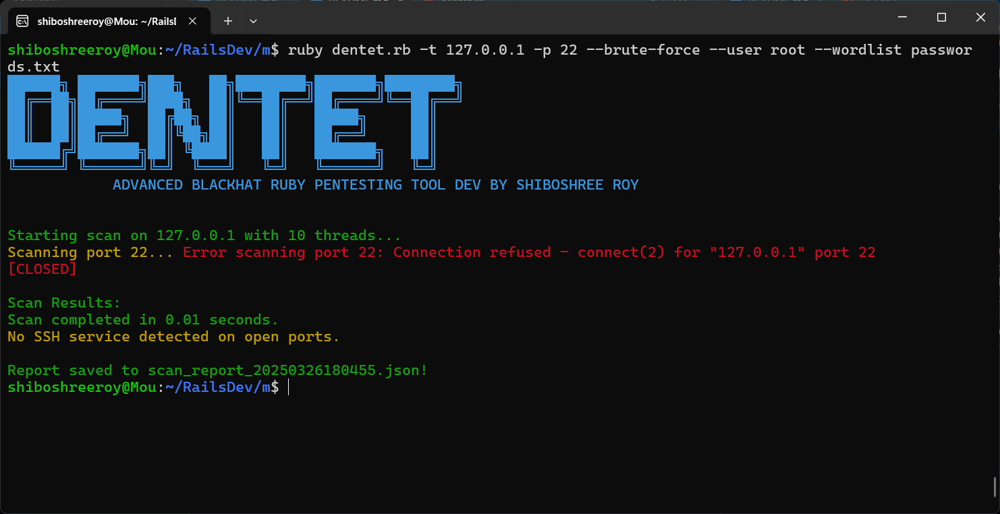

# Advanced Blackhat (DENTET)Ruby Pentesting Tool

This is an advanced Blackhat Ruby-based pentesting tool designed for scanning ports, detecting services, and brute-forcing SSH login credentials using a wordlist. The tool also generates detailed scan reports for further analysis.

---

---
## Features

- **Port Scanning**: Scan a range of ports on a target and identify open/closed ports.
- **Service Detection**: Identify common services like FTP, SSH, HTTP, and more based on port numbers and banners.
- **Banner Grabbing**: Retrieve banners from services like FTP, HTTP, and SSH to identify versions or configurations.
- **SSH Brute-Force**: Attempt to brute-force SSH login credentials using a provided wordlist and username.
- **Scan Reports**: Generate detailed JSON reports of the scan results, including detected services and banners.
- **Multi-threaded Scanning**: Perform scans using multiple threads for faster results.

## Requirements

Ensure that you have the following dependencies installed:

- Ruby 2.x or higher
- Required gems: `socket`, `timeout`, `json`, `thread`, `optparse`, `net-ssh`

To install the required gems, run:

```bash
gem install net-ssh
```

## Installation

1. Clone this repository:

```bash
git clone https://github.com/shiboshreeroy/dentet.git
cd dentet
```

2. Install dependencies:

```bash
gem install -r bundle
```

## Usage

The tool is run via the command line with several options. Below is the general usage:

```bash
ruby dentet.rb [options]
```

### Options

- `-t, --target TARGET`: Specify the target IP or domain for the scan.
- `-p, --ports PORTS`: Specify a comma-separated list of ports to scan (e.g., `21,22,80`).
- `--threads THREADS`: Set the number of threads for scanning (default is `10`).
- `--brute-force`: Enable SSH brute-forcing on detected SSH ports.
- `--wordlist FILE`: Provide the wordlist file for SSH brute-forcing.
- `--user USERNAME`: Specify the username for SSH brute-forcing.

### Example Usage

**Scan a target on ports 22 and 80 with 10 threads:**

```bash
ruby dentet.rb -t 192.168.1.1 -p 22,80 --threads 10
```

**Scan and perform SSH brute-force with a wordlist:**

```bash
ruby dentet.rb -t 192.168.1.1 -p 22 --brute-force --wordlist /path/to/wordlist.txt --user root
```

### Report Generation

After completing the scan, the tool generates a JSON report saved in the same directory as the script. The report includes:

- Target IP/domain
- Scan timestamp
- Results with detected services, banners, and port statuses

### Example of a Report:

```json
{
  "target": "192.168.1.1",
  "timestamp": "2025-03-25T15:30:00Z",
  "results": [
    {
      "port": 22,
      "status": "open",
      "service": "SSH",
      "banner": "SSH-2.0-OpenSSH_7.9"
    },
    {
      "port": 80,
      "status": "open",
      "service": "HTTP",
      "banner": "HTTP/1.1 200 OK"
    }
  ]
}
```

## Development

Feel free to fork the repository and submit pull requests. If you have any bug reports or feature requests, please open an issue on GitHub.

## License

This tool is provided under the MIT License. See the [LICENSE](LICENSE) file for more details.

## Disclaimer

This tool is intended for educational purposes and legal penetration testing only. Use it responsibly and with permission from the owner of the target system. Unauthorized access to computer systems is illegal and punishable by law.

## For Help 
[Shiboshree ROy](https://github.com/ShiboshreeRoy/dentet.git)